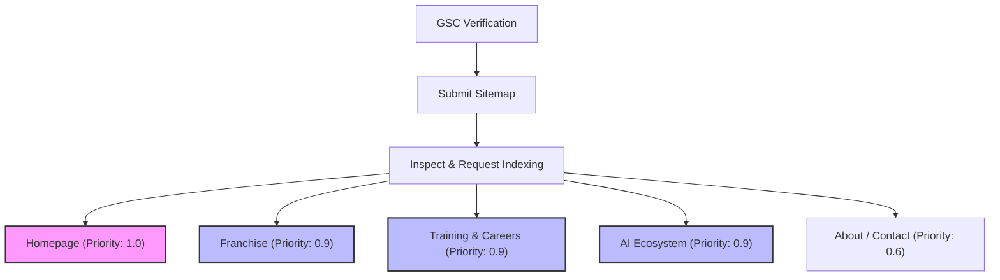

# Google Search Console (GSC) Setup Guide - SOVAKA LifeSciences

This document provides a step-by-step walkthrough to connect, verify, and configure **SOVAKA LifeSciences** on Google Search Console (GSC) using DNS domain-level verification on Hostinger.

---

## STEP 1: CREATE A DOMAIN PROPERTY IN GSC

Using a **Domain Property** (e.g. `sovakalifesciences.com`) is highly recommended over a URL-prefix property because it automatically tracks:
* Both `http://` and `https://` protocols.
* Both `www.` and non-`www.` subdomains.
* Any future subdomains (e.g. `portal.sovakalifesciences.com`).

### Instructions:
1. Go to the [Google Search Console Dashboard](https://search.google.com/search-console).
2. Click the property dropdown in the top-left corner and select **Add Property**.
3. In the modal, select the **Domain** card (left side).
4. Enter the domain: `sovakalifesciences.com` (do not include `https` or trailing slashes).
5. Click **Continue**.

---

## STEP 2: CONFIGURE THE DNS TXT RECORD ON HOSTINGER

Google will generate a unique TXT verification token for your domain. You must add this token to your Hostinger DNS Zone.

### 1. Copy the Verification Token:
* Google will display a modal saying: *"Instructions for: Any DNS provider"*.
* Copy the string under **"Copy the TXT record below"**. It will look exactly like this:
  `google-site-verification=YOUR_UNIQUE_TOKEN_FROM_GOOGLE`

### 2. Add the Record in Hostinger hPanel:
1. Log in to your **Hostinger hPanel** (`hpanel.hostinger.com`).
2. Navigate to **Websites** -> Click **Manage** on your domain (`sovakalifesciences.com`).
3. On the left sidebar, go to **Advanced** -> **DNS Zone Editor**.
4. In the **Manage DNS records** section, add a new record with the following parameters:

| Field | Configuration | Notes |
| :--- | :---: | :--- |
| **Type** | `TXT` | Select TXT from the dropdown. |
| **Name / Host** | `@` | Points to the root domain (`sovakalifesciences.com`). |
| **TXT Value** | `google-site-verification=YOUR_UNIQUE_TOKEN` | Paste the exact string copied from Google. |
| **TTL** | `14400` (or `3600`) | Time to Live (default is fine). |

5. Click **Add Record**.

### 3. Verify in GSC:
* Go back to Google Search Console and click **Verify**.
* *Note: DNS changes can take a few minutes to propagate. If it fails initially, wait 3–5 minutes and click Verify again.*

---

## STEP 3: SUBMIT THE XML SITEMAP

We verified that the sitemap is active, compiles all 15 routes using absolute clean URLs, and is fully ready for crawling.

* **Live URL**: `https://sovakalifesciences.com/sitemap.xml`

### Instructions to Submit:
1. In GSC, click **Sitemaps** under the *Indexing* section in the left sidebar.
2. Under **Add a new sitemap**, type: `sitemap.xml`
3. Click **Submit**.
4. You will see a green *"Success"* status, confirming Google has queued all 15 URLs for index mapping.

---

## STEP 4: RECOMMENDED INDEXING STRATEGY

To maximize initial search visibility for launch campaigns, prioritize page crawls as follows:

### 1. Homepage (`https://sovakalifesciences.com`)
* **Index Priority**: **Critical (1.0)**
* **Targets**: Brand searches ("SOVAKA LifeSciences"), dental imaging infrastructure positioning.
* **GSC Action**: Right after DNS verification, paste the homepage URL into the GSC top search bar (**URL Inspection tool**), click *Test Live URL*, and then click **Request Indexing**. This places the root page in Google's high-priority crawl queue.

### 2. Franchise Page (`https://sovakalifesciences.com/franchise`)
* **Index Priority**: **High (0.9)**
* **Targets**: Commercial/transactional searches ("CBCT OPG Franchise", "dental diagnostic franchise Maharashtra").
* **Schema Benefit**: Contains the **FAQ Schema** to display drop-down FAQ snippets in search results.
* **GSC Action**: Submit via URL Inspection immediately after the homepage.

### 3. Training & Job Opportunities (`https://sovakalifesciences.com/training-careers`)
* **Index Priority**: **High (0.9)**
* **Targets**: Career/educational terms ("dental radiology technician course Pune", "CBCT operator training").
* **Schema Benefit**: Leverages **EducationalOccupationalProgram** and **FAQ** schemas.
* **GSC Action**: Submit via URL Inspection.

### 4. AI Ecosystem (`https://sovakalifesciences.com/technology`)
* **Index Priority**: **High (0.9)**
* **Targets**: Technology terms ("dental radiology AI integration", "intelligent dental PACS cloud").
* **Schema Benefit**: Leverages **FAQ** schema.
* **GSC Action**: Submit via URL Inspection.

### 5. About & Contact Pages (`https://sovakalifesciences.com/about` & `/contact`)
* **Index Priority**: **Standard (0.6)**
* **Targets**: Corporate credibility, general contact inquiries.
* **GSC Action**: Let Google discover and index these naturally via the sitemap submission. Manual Inspection queues are not necessary.
